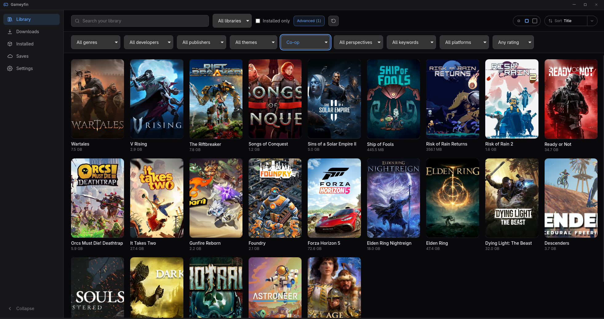
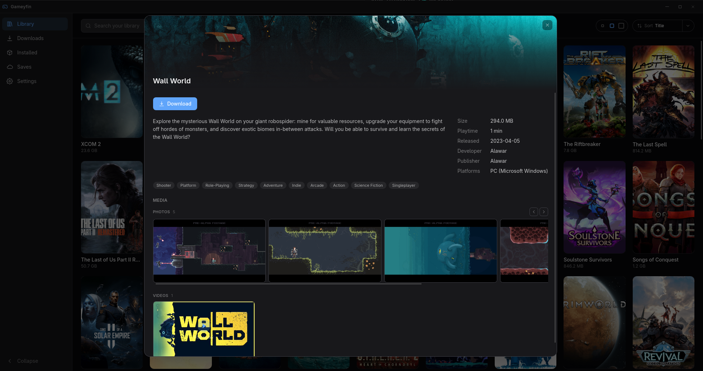
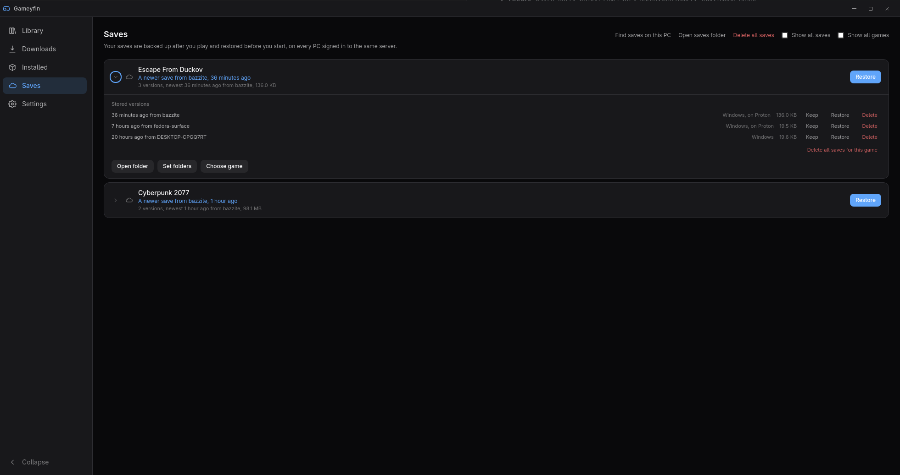
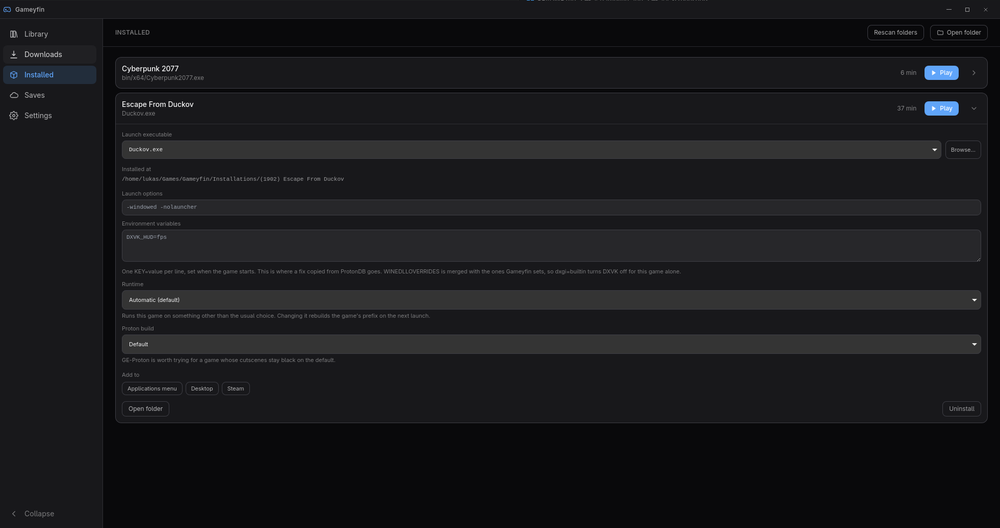

# gameyfin-app

A desktop client for [Gameyfin](https://github.com/gameyfin/gameyfin) on Windows and Linux.
Browse your server's library, download and install games, play them, and keep your saves
in sync between PCs.

## Features

- **Library**: search, filters, sorting, cover sizes, photos and trailers. Stays usable offline.
- **Downloads**: a speed limit, several games folders and optional auto install.
- **Installing**: unpacks archives (including password protected ones), runs setup programs,
  finds the game's executable and uninstalls cleanly.
- **Playing**: playtime tracking, and a readable reason when a game crashes on start.
- **Windows games on Linux**: Proton through umu, GE-Proton, Wine as a fallback, DXVK and
  vkd3d-proton, per-title fixes, and per-game launch options and prefixes.
- **Save sync**: saves are backed up with [Ludusavi](https://github.com/mtkennerly/ludusavi)
  after you play and restored before you start. They can be kept on the Gameyfin server,
  in a folder or on a WebDAV share, with version history, conflict handling and
  Windows/Proton interchange.
- **Shortcuts**: applications menu, desktop and Steam.
- **Controller support**: navigation by gamepad and a large layout for the sofa.
- **Desktop integration**: tray icon, start with login, notifications, taskbar progress and
  automatic updates.

> **Save sync with a Gameyfin server** needs server support that is not merged into
> [Gameyfin](https://github.com/gameyfin/gameyfin) yet. Until it is, run `ghcr.io/wieluk/gameyfin:save-sync` as your server.
> Saving to a folder or WebDAV share works with any Gameyfin server.

## Screenshots

| Library | Game details |
| --- | --- |
|  |  |
| **Saves** | **Installed games** |
|  |  |

## Install

Download a build from the [releases](https://github.com/wieluk/gameyfin-app/releases) page:
`.exe` for Windows, `.deb`, `.rpm` or `.flatpak` for Linux.
See [Getting started](docs/getting-started.md) for first-time setup.

## Documentation

The [docs](docs/README.md) explain every feature in more depth, especially
[save sync](docs/saves.md).

## Development

```bash
npm install
npm run dev              # frontend only, with fixture data
npm run fetch-sidecars   # bundled helpers, needed for the Rust tests
npm run tauri dev        # the full app
npm run verify           # typecheck, tests and clippy
npm run package          # installers for this platform, into build/
```

Linux builds need `libudev-dev` plus the WebKit and GTK dev packages. Installers cannot be
cross-built; `.github/workflows/release.yml` builds each platform on its own runner.

## Licence

MIT
